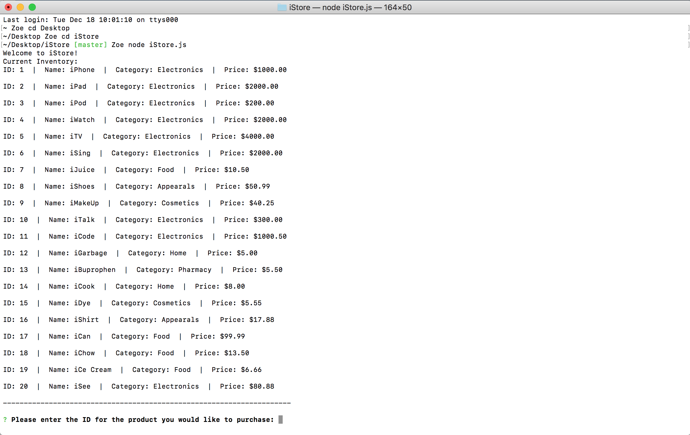

# iStore

### Overview

In this project, I created a storefront at the CLI (Command Line Interface) by utilizing Node.js and MySQL. The app takes in orders from customers and depletes stock from the store's inventory.

To run the app, simply download all files and run NPM install with its dependencies and import SQL commands to the MySQL Workbench.

To start, run `node iStore.js` at your command prompt.

### Technologies

* MySQL
* Node.js
* Inquirer
* Command Line Interface

